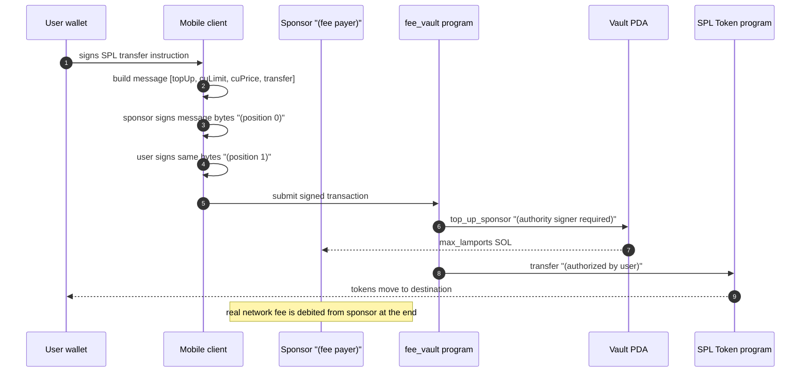

# Architecture

`fee_vault` lets a user submit a Solana transaction without holding any SOL,
while the lamports that pay the network fee come from a single program-owned
PDA (the "vault") rather than from a per-user throwaway account. There are two
keys involved on the operator side and two on the user side; the section below
walks through how they interact.

## Account roles

| Account | Owner | Holds | Signs |
|---|---|---|---|
| **Vault PDA** (`[b"fee_vault"]`) | `fee_vault` program | All sponsorable SOL | Never (it's a PDA) |
| **Authority** | System program | A trivial amount of SOL for rent | `top_up_sponsor`, `sweep_remainder`, `update_limits` |
| **Emergency authority** | System program | Trivial | `emergency_pause`, `resume_operations` |
| **Sponsor** | System program | Topped-up SOL during a tx | Acts as **fee payer** of the surrounding tx |
| **User wallet** | System program | The user's tokens | The SPL transfer instruction (as the source ATA owner) |

In practice the **sponsor** and the **authority** are usually the same key, so
the flow only needs two operator-side signatures: one as fee payer, one as the
`top_up_sponsor` authority. The Dart client supports this collapsed layout out
of the box.

## Transaction layout

A single gasless transfer is a four-instruction transaction:

```
[0] fee_vault.top_up_sponsor(max_lamports)        // signed by authority
[1] ComputeBudget.SetComputeUnitLimit(units)
[2] ComputeBudget.SetComputeUnitPrice(microLamports)
[3] spl_token.transfer(amount)                    // signed by user
```

The transaction's fee payer is the **sponsor** account. Because the fee payer
must sign the message, the sponsor's signature appears at position 0 in the
signature array. The user's signature appears wherever the user's pubkey first
shows up in the compiled message's account keys (typically position 1).

If `top_up_sponsor` reverts (e.g., daily limit exceeded, paused, wrong
authority), the entire transaction reverts atomically: the user's tokens stay
where they are and no fee is charged.



## Why this design over the alternatives

| Option | What | Tradeoffs |
|---|---|---|
| **Pre-funded throwaway wallet per user** | Generate a one-shot keypair, fund it for one transaction, throw it away | Bleeds rent (each new account costs ~0.00089 SOL until closed); UX has extra wallets to track |
| **Server-side relayer that signs the user's tx** | Backend holds the user's key | Hard regulatory and security story; you become a custodian |
| **Vault PDA with per-tx top-up (this design)** | One program-owned account; lamports flow on-demand | Requires a custom on-chain program; upside is bounded blast radius and zero rent leakage |

The vault PDA approach is what Phantom's session keys, Jupiter's fee splits,
and Magic Eden's makers use, modulo specifics.

## Limit enforcement

Two values stored on `FeeVault` cap how much the program will release:

- **`max_per_transaction`** — the largest single `top_up_sponsor` call. Bounds
  what one compromised authority signature can move per transaction.
- **`max_daily_spend`** — the cumulative cap for one UTC day. The on-chain
  `current_day = clock.unix_timestamp / 86400` resets the counter the first
  time the program is invoked on a new day.

Both are enforced before lamports move. Together they bound the worst case if
the operational `authority` key is compromised: an attacker can only drain at
most `max_daily_spend` per day until the `emergency_authority` flips the pause
switch. The two keys can (and should) live on different machines.

## Code layout

- [`programs/fee_vault/src/lib.rs`](../programs/fee_vault/src/lib.rs) — the
  Anchor program. Single file; no internal modules.
- [`tests/fee_vault.ts`](../tests/fee_vault.ts) — Anchor TS test suite. The
  `top_up_sponsor rejects an unauthorized signer` case is the one that proves
  the `has_one = authority` constraint is wired up correctly.
- [`client-dart/lib/src/`](../client-dart/lib/src/) — the Dart client. Each
  subdirectory mirrors one layer:
  - `wallet/` — BIP39 + Ed25519 HD derivation
  - `anchor/` — discriminator + instruction encoders + compute budget helpers
  - `transaction/` — multi-signature assembly with sponsor as fee payer
  - `client/` — high-level `FeeVaultClient` facade
